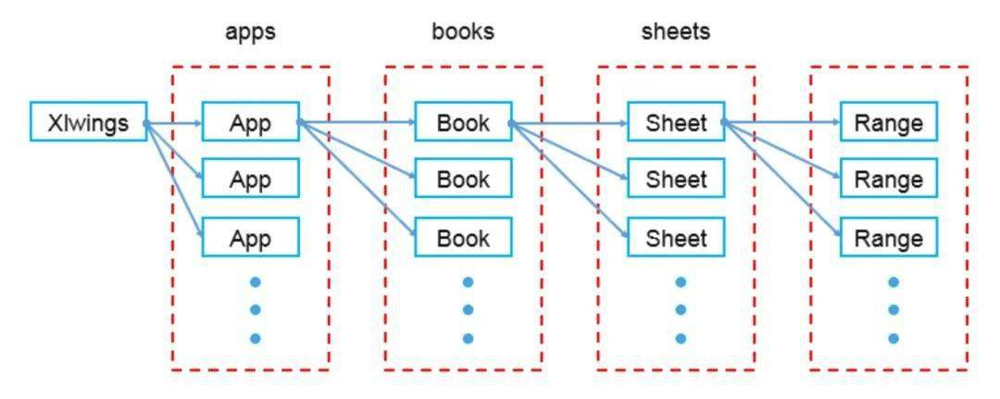

# xlwings

* 结构图



app：应用层
books：总表层
sheets：单表

## 读取表

```python
import xlwings as xw
wb = xw.Book()  # this will create a new workbook
wb = xw.Book('FileName.xlsx')  # connect to a file that is open or in the current working directory
wb = xw.Book(r'C:\path\to\file.xlsx')  # on Windows: use raw strings to escape backslashes
```
## 表格操作

```python
import xlwings as xw

wb = xw.Book('FileName.xlsx')
sht = wb.sheets['工作簿名']

# 清空表格
sht.clear() 

# 设置a列到zz列格式(不管有没有数据的左右列，最好指定范围)
sht.range("a:zz").api.NumberFormat = "@"
"""
@ 文本
"""

# 设置字体大小
sht.range('a:zz').api.font.size = 15

# 设置字体
sht.range("a:a").api.font.name = "微软雅黑"

# 自动调整单元格大小
sht.autofit()

# 读取单元格数据，返回二维数组[[a,b],[c,d]]
sht.range('a1:b2').value
# 这条只读取一行，返回[a,b]需要注意
sht.range('a1:a2').value

```